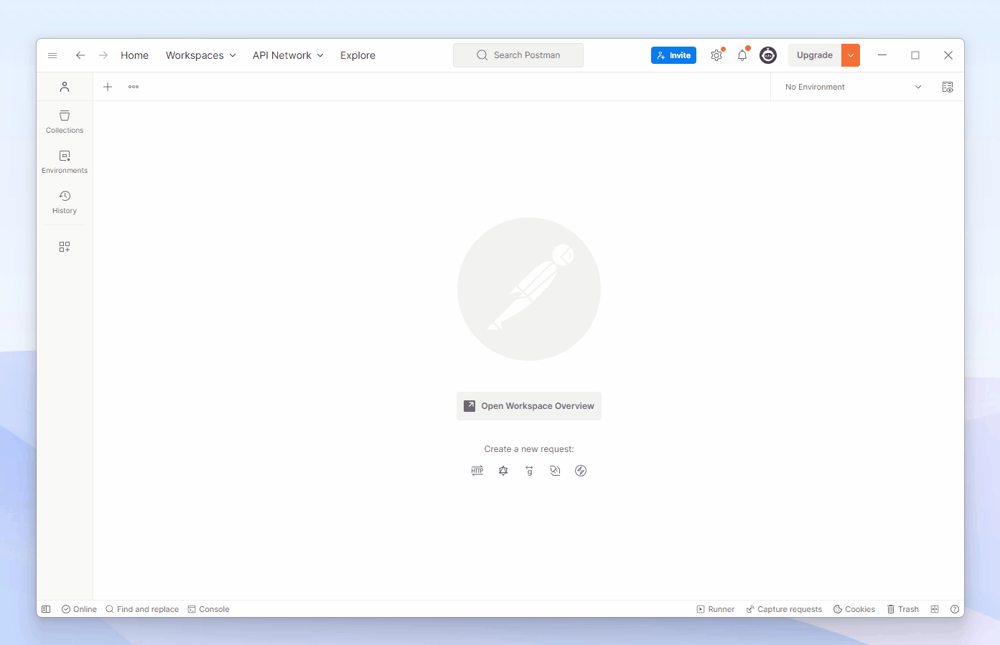

# Pytube-FFMPEG-downloader

The project is a Flask application that allows users to download videos from YouTube. The application exposes two API endpoints: `/api/download` and `/api/receive_url`.

The `/api/download` endpoint enables users to download a video by specifying its URL and itag, while the `/api/receive_url` endpoint retrieves the formats and information of a video based on its URL.

This API use the pytube library to interact with the YouTube API and download videos. It supports various video formats and also handles the downloading and merging of audio and video streams for non-progressive videos with FFMPEG.

The goal of this project is to provide an easy-to-use solution for downloading videos from YouTube.

## Request with Postman

Request for `/api/receive_url`:  
  


Request for `/api/download`:
  


## Installation

### Install with Docker:

1. Clone this code repository to your local machine.

2. Ensure that Docker is installed on your machine.

3. Build the Docker image by running the following command at the root of the project:

   ```shell
   docker build -t your_image_name .
   ```

4. Run the Docker container using the following command:

   ```shell
   docker run -d -p 5000:5000 your_image_name
   ```

5. Access http://localhost:5000 in your browser.

### Install manually

1. Clone this code repository to your local machine.
2. Ensure that Python 3.x is installed.
3. Install the dependencies by running the following command:
   ```shell
   pip install -r requirements.txt
   ```
4. Install FFMPEG from here: [ffmpeg.org](https://ffmpeg.org/download.html)
5. Now let's remove the ";" in line 287 of the file cipher.py:

   **For Windows**
   You can probably find it at this location:  
    `C:\Users\username\AppData\Local\Programs\Python\Python311\Lib\site-packages\pytube\cipher.py`

   **For Linux**
   You can probably find it at this location:  
    `/usr/local/lib/python3.11/site-packages/pytube/cipher.py`

6. Now lets run our Flask api :
   ```shell
   pip install -r requirements.txt
   ```
7. Access http://localhost:5000 in your browser.

## Contributing

Pull requests are welcome. For major changes, please open an issue first
to discuss what you would like to change.

Please make sure to update tests appropriately.

## License

The code in this project is licensed under the MIT License. See [MIT](https://choosealicense.com/licenses/mit/) for details.
